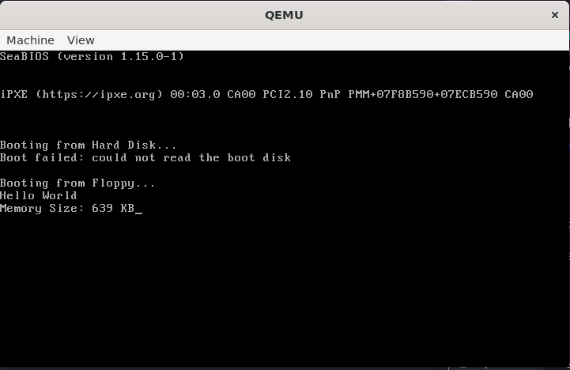

# HELLO-SOLVED

## BIOS Interrupt Implementation Explanation

I have implemented a function called `get_mem_size()` that uses BIOS interrupt 0x12 to retrieve the amount of conventional memory in the system.

## Proof of Concept

The implementation has been successfully tested in QEMU, as shown in the screenshot below:



### Screenshot Analysis

The screenshot shows:
1. The QEMU window emulating a bare-metal environment
2. The "Hello World" text displayed at the top
3. The "Memory Size: 639 KB" message (where 639 is the amount of conventional memory reported by BIOS)
4. The program correctly executing both the original functionality and our new BIOS interrupt call

### Implementation Details

1. **Assembly Function (libc.S)**:
   ```assembly
   /* Function to get conventional memory size using BIOS interrupt 0x12 */
   get_mem_size:
       int $0x12          /* Call BIOS interrupt 0x12 - memory size determination */
       ret                /* Return memory size in kilobytes in %ax */
   ```

   This function calls BIOS interrupt 0x12, which returns the conventional memory size in kilobytes (KB) in the AX register. According to the BIOS specification, this interrupt does not require any input parameters and automatically places the result in AX.

2. **Function Declaration (stdio.h)**:
   ```c
   unsigned short __attribute__((fastcall, naked)) get_mem_size(void);
   ```

   The function is declared with the appropriate attributes to match our assembly implementation.

3. **Integration in main.c**:
   ```c
   /* Convert unsigned short to string and print it */
   void print_uint(unsigned short num)
   {
     // Implementation that converts an integer to a string for printing
   }

   int main(void)   
   {
     printf("Hello World");
     printf("\r\nMemory Size: ");
     
     unsigned short mem_kb = get_mem_size();
     print_uint(mem_kb);
     printf(" KB");
     
     return 0;
   }
   ```

   In the main function, I call `get_mem_size()` to get the memory size, then convert it to a string using a utility function `print_uint()` that I created, and finally print it with the "KB" unit.

4. **Makefile Changes**:
   Added `-fno-stack-protector` flag to the compiler options for main.c to prevent stack protection code generation, which is not supported in this bare-metal environment.

## How It Works

1. When the program runs, it first displays "Hello World" as in the original program.
2. Then it calls the BIOS interrupt 0x12 via our `get_mem_size()` function to get the conventional memory size.
3. The memory size value is converted from binary to a string representation.
4. The string representation of the memory size is printed followed by "KB".

The implementation demonstrates how to:
1. Call BIOS services from assembly code
2. Return values from assembly functions
3. Process numeric values in C code
4. Display formatted output in a bare-metal environment

This function could be extended to call other BIOS interrupts for various system information or functionality, such as getting the real-time clock (int 0x1a) or keyboard input (int 0x16).
